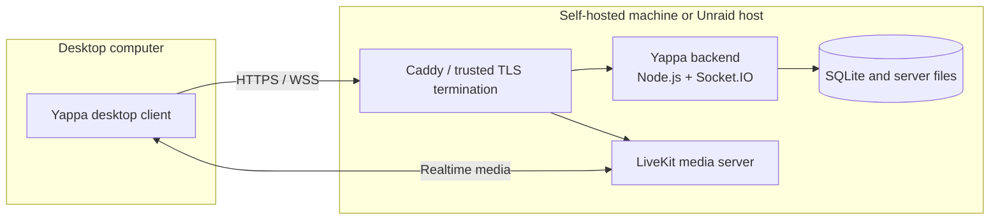

# Yappa

Yappa is an open-source, self-hosted community communication platform with
desktop chat, voice, video, and screen sharing. It is designed for communities
that want to operate their own infrastructure and retain control of their data.

> **Project status: Pre-alpha.** Yappa is undergoing active development and
> limited friend testing. Current builds are unsigned and have not completed
> independent security review. Do not rely on Yappa for sensitive or production
> communication yet.

[Download pre-release builds](https://github.com/CtrlAltForgot/Yappa/releases) ·
[Documentation](docs/README.md) · [Project status](docs/PROJECT_STATUS.md) ·
[Report a vulnerability](SECURITY.md)

## What is Yappa?

Yappa combines a Flutter desktop client with a Node.js/Socket.IO backend and a
LiveKit media server. Communities run the server themselves, while members use
desktop clients for persistent text feeds and realtime communication.

## Why Yappa?

- Community-owned hosting and data.
- Open development without premium feature gates or advertising.
- One desktop space for text, voice, camera, and screen sharing.
- Explicit documentation of incomplete validation and security boundaries.

## Current capabilities

| Area | Status | Current evidence and boundary |
| --- | --- | --- |
| Text communication | Available / experimental | Persistent feeds, attachments, editing, pagination, and an MLS-based encrypted-feed path exist; legacy feeds remain plaintext on the server. |
| Community administration | Available | Server identity, membership, channels, roles, bans, branding, and session management are implemented. |
| Voice and video | Experimental | LiveKit integration and client-held media-key paths exist; real native two-client and broader network validation remain incomplete. |
| Screen sharing | Partially validated | Linux Wayland capture has targeted validation; Windows, macOS, X11, desktop audio, and cross-client matrices remain incomplete. |
| Self-hosting | Experimental | The Docker/Caddy/LiveKit path and Unraid deployment have extensive tests; a signed public server release is not published. |
| Identity and sessions | Partially validated | Server identity pinning, device identity, token hashing, secure-storage integration, expiry, rotation, and revocation exist; real-platform coverage remains incomplete. |
| Message and media encryption | Not independently reviewed | Guarded implementations and automated tests exist, but Yappa does not claim verified E2EE. |
| Desktop platforms | Pre-release test builds | Unsigned Linux and Windows prerelease artifacts are published; macOS has hosted build evidence but is not presented as a currently published user build. |

## Current project status

The repository is ahead of a supported public release. Automated backend,
client, packaging, security, and release-evidence gates exist, but signing,
independent review, real multi-client validation, and wider platform/network
testing remain release blockers. See [the dated status snapshot](docs/PROJECT_STATUS.md)
and [known limitations](docs/KNOWN_LIMITATIONS.md).

## Supported and tested platforms

No platform is currently designated production-supported. Current public
pretest artifacts target Linux x64 and Windows x64. Hosted macOS build checks
have passed at recorded revisions, but real macOS validation and a current
public build remain incomplete. Generated Flutter platform directories alone
are not support claims.

## Quick start

1. Review [client installation](docs/installation/CLIENT_INSTALLATION.md).
2. Download an unsigned prerelease from [GitHub Releases](https://github.com/CtrlAltForgot/Yappa/releases), or build locally.
3. Connect only to a Yappa server you trust and keep sensitive data out of pre-alpha testing.

## Self-hosting

The current deployment path packages Node.js, SQLite persistence, LiveKit, and
Caddy for trusted TLS termination. Start with the [self-hosting guide](docs/installation/SELF_HOSTING.md)
and the detailed [server deployment contract](server/DEPLOYMENT.md).

## Architecture overview

More detail: [architecture](docs/ARCHITECTURE.md).

## Security status

Yappa has not completed independent security review. Some message feeds remain
legacy plaintext, the database and server files are not encrypted by Yappa at
rest, and current media/message encryption paths do not yet satisfy every
release claim gate. Read the [public security policy](SECURITY.md),
[detailed security plan](docs/security/SECURITY_PLAN.md), and
[known limitations](docs/KNOWN_LIMITATIONS.md).

## Roadmap

Work is organized by release phase in the [roadmap](docs/ROADMAP.md). The next
focus is pre-alpha stabilization and evidence, not declaring feature maturity.

## Contributing

Read [CONTRIBUTING.md](CONTRIBUTING.md) before opening a focused pull request.
Setup and verification commands are in the [development guide](docs/development/DEVELOPMENT.md),
[testing guide](docs/development/TESTING.md), and component READMEs.

## Development approach

Yappa is developed with substantial AI-assisted tooling under human direction.
Product requirements, architecture decisions, deployment validation, tests,
security claims, and release criteria are documented and reviewed as part of
the project. Contributors remain responsible for understanding and validating
everything they submit.

## License

Yappa is licensed under [GPL-3.0](LICENSE).
